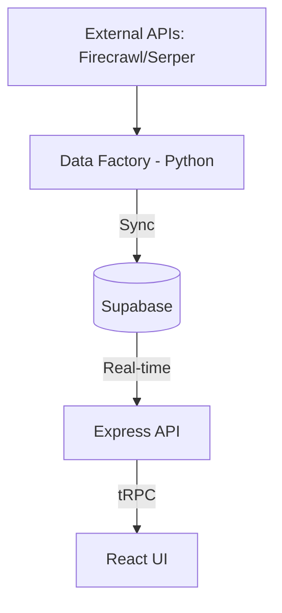

# 🎯 NERV Sniper Factory v20.0

**Operational GTM Intelligence Engine & Command Center**

NERV Sniper is a high-precision lead enrichment and strategic intelligence platform. It transforms raw company data into actionable "Kill-Shot" sales strategies using a multi-layer agentic architecture.

## 🚀 Status: MVP in Development (70%)

- **Frontend**: Premium Command Center (React + TypeScript) - **85%**
- **Data Engine**: Hybrid Scraper (Firecrawl + Scrape.do + Serper) - **60%**
- **Backend**: Express + tRPC Integration - **40% (In Progress)**
- **Database**: Supabase Real-time Persistence - **40% (In Progress)**

## 🛠️ Tech Stack

- **Frontend**: React 19, Vite, Tailwind CSS 4, shadcn/ui, Recharts.
- **Backend**: Node.js, Express, tRPC (Type-safe API).
- **Database**: Supabase (PostgreSQL + Real-time).
- **Engine**: Python 3.11, Firecrawl API, Scrape.do (Residential Proxies), Serper (URL Discovery).
- **Deployment**: Vercel (Frontend/Backend), Dedicated VM (Data Engine).

## 🏗️ Architecture



## 📦 Key Components

### 1. Data Factory (`/engine`)
Autonomous workers that discover, scrape, and score leads based on custom ICP (Ideal Customer Profile) logic.
- `factory_worker.py`: Batch processing with failover proxy logic.
- `lead_scorer.py`: ML-based quality scoring.

### 2. Command Center (`/client`)
Professional dashboard for real-time monitoring and GTM strategy execution.
- **Battle Cards**: Deep-dive intelligence for every target.
- **Telemetry**: Real-time status of the enrichment engine.

### 3. GTM Insights (`/scripts_insights`)
Strategic analysis layer that generates "Kill-Shots" and points of pain for sales teams.

## 🚦 Getting Started

1. **Environment**: Copy `engine/.env.example` to `engine/.env` and add your API keys.
2. **Install**:
   ```bash
   npm install        # Root dependencies
   pip install -r engine/requirements.txt
   ```
3. **Run**:
   - Web App: `npm run dev`
   - Data Factory: `python engine/factory_worker.py`

---
**Powered by NERV Strategic Command**
